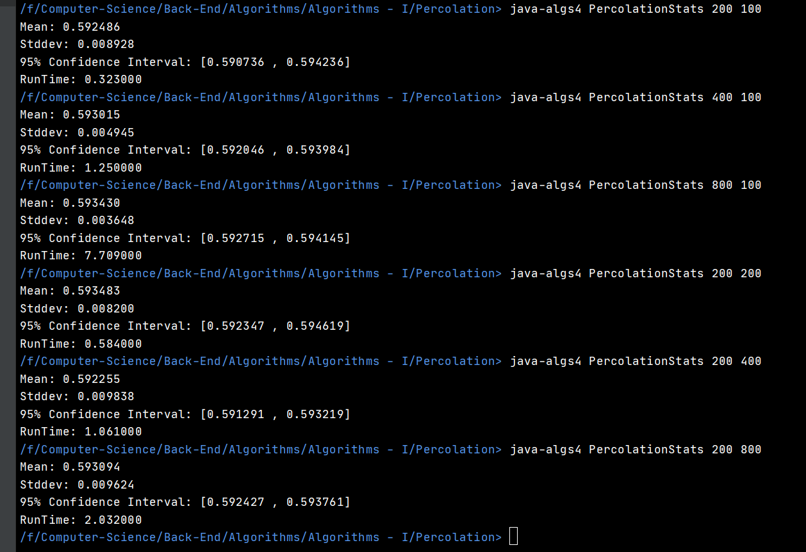

# Percolation
## Check whether a given grid Percolates or not

<h3> Main Implementation:</h3> Percolation.java
<h3>Monte-Carlo Simulation:</h3> PercolationStats.java
<h3>Grid Visualisation:</h3> PercolationVisualizer.java & InteractivePercolationVisualizer.java

## Time Complexity

