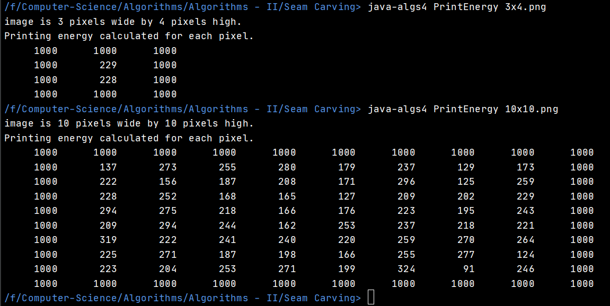
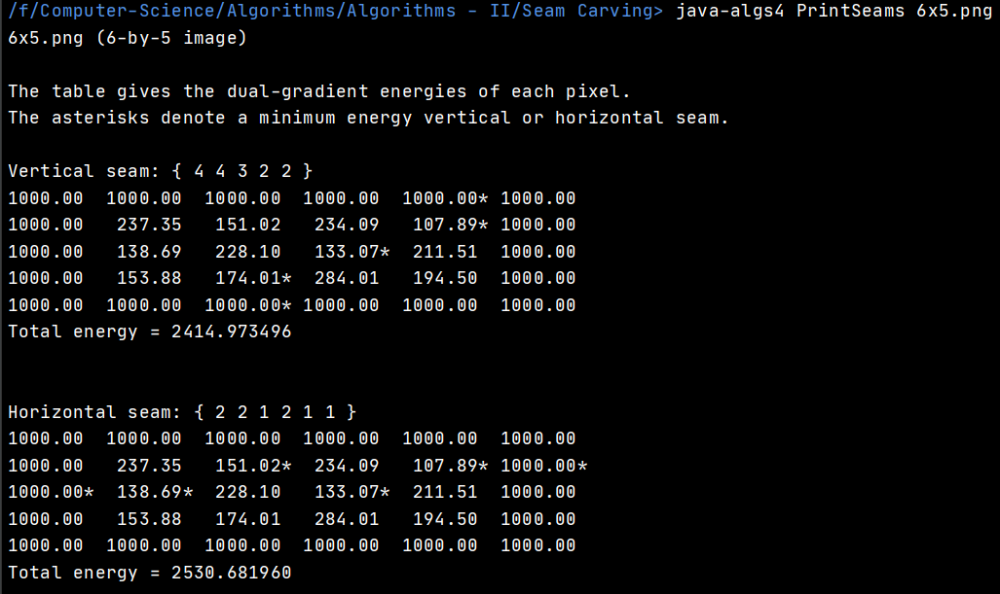
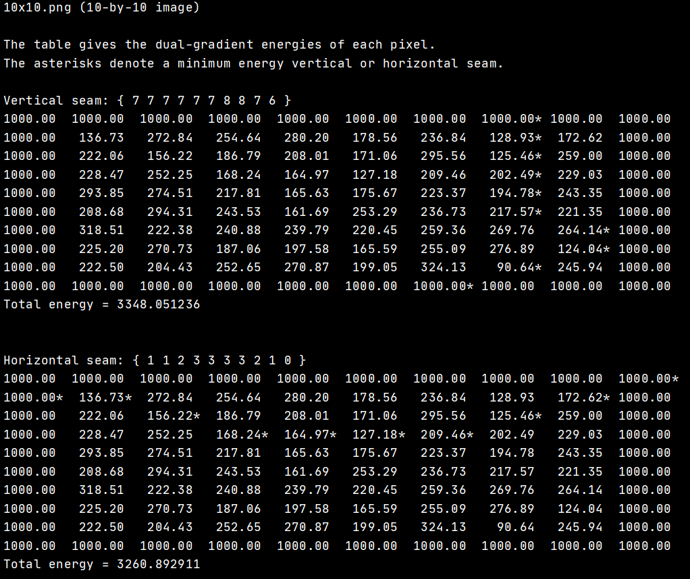
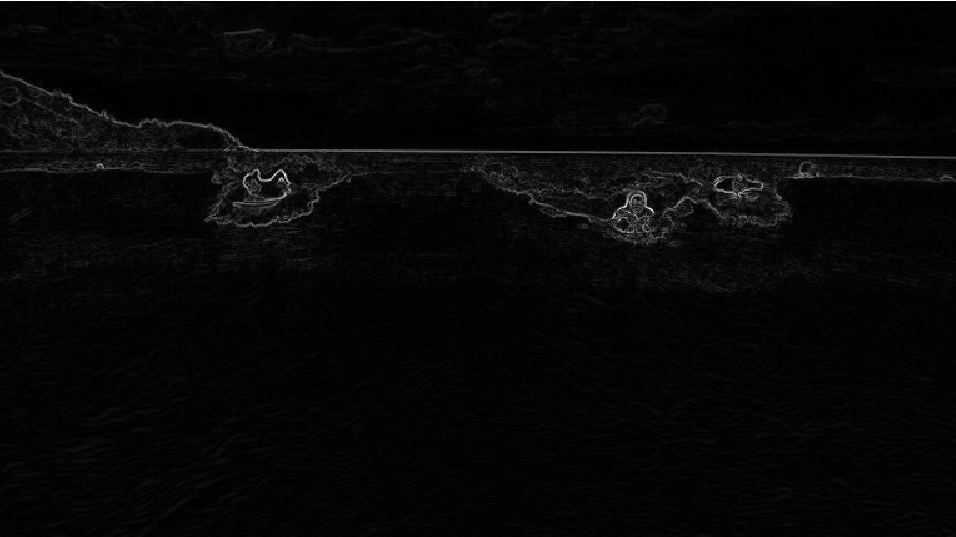
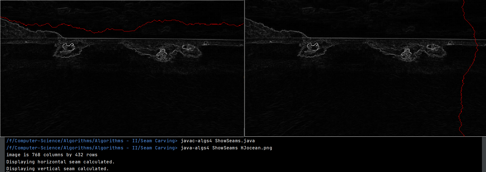
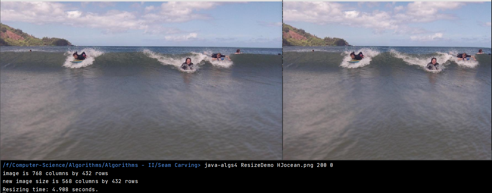
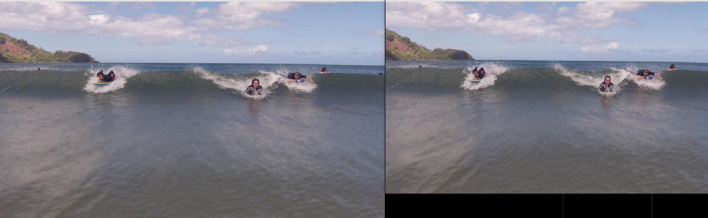
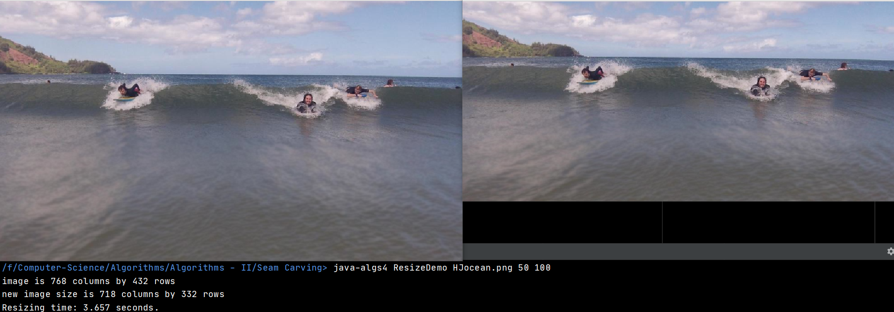
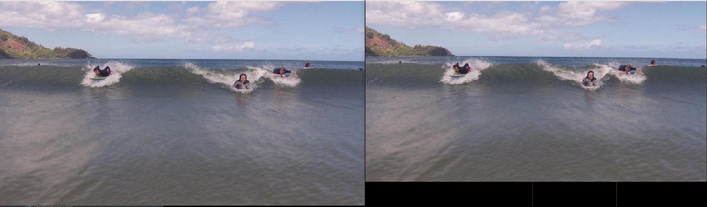

# Seam Carving

## Implement a Shortest Path Algorithm to determine the least important seam in a picture in order to resize ii.

## Implementation

<ul> 
<li><b>SeamCarver.java :</b> Implements all the seam finding and energy calculations.</li>
<li><b>PrintEnergy.java :</b> Prints the energy values of every pixel in a given picture</li>
<li><b>PrintSeams.java </b> Marks the least important seam in a grid of energy values created from a picture</li>
<li><b>ShowEnergy.java :</b> Shows the given image as a heatmap of energy values</li>
<li><b>ShowSeams.java</b> Highlights the to-be-deleted seam in red in the energy heatmap</li>
<li><b>ResizeDemo.java :</b> Resizes an image based on an input of how many horizontal and vertical seams to delete</li>

## Unit-Tests and Outputs

### CLI Tests

### Image Tests

### Resized images
#### HJocean.png
##### Reduce width by 200px

##### Reduce width by 100px and height by 50px

##### Reduce width by 50px and height by 100px

##### Reduce both height and width by 50px

#### Chameleon.png
##### Reduce width by 200px

